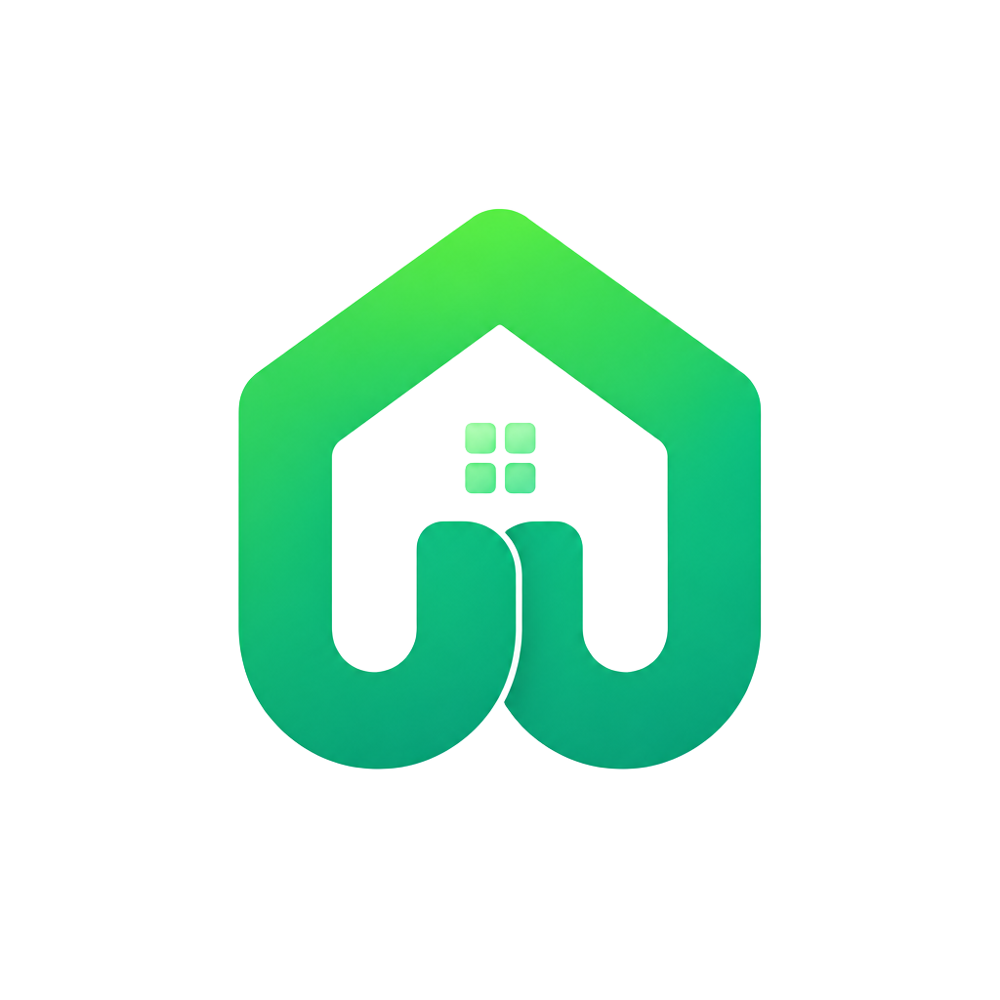

# U Are Dormed — Premium Dorm Management & Monitoring



**U Are Dormed** is a high-fidelity, comprehensive platform designed to bridge the gap between landlords and tenants. It streamlines the entire dorm living experience—from discovering and reserving premium spaces to managing real-time billing and shared expenses.

## 🚀 Features

### For Tenants
- **Dorm Discovery**: Browse curated listings with high-quality visuals and detailed floor plans.
- **Seamless Reservation**: Instant slot booking with secure verification.
- **Smart Wallet**: Real-time tracking of shared bills, rent, and utility payments.
- **Integrated Inbox**: Direct communication channel with landlords and housemates.
- **Personal Dashboard**: High-level overview of tenancy status and upcoming deadlines.

### For Landlords
- **Property Management**: Centralized hub to monitor multiple listings and room statuses.
- **Tenant Onboarding**: Automated workflow for vetting and accepting new residents.
- **Billing Automation**: Generate and track shared utility bills effortlessly.
- **Analytics Dashboard**: Insights into occupancy rates and revenue tracking.

---

## 🛠️ Tech Stack

- **Frontend**: [React](https://reactjs.org/) + [Vite](https://vitejs.dev/)
- **Styling**: [Tailwind CSS](https://tailwindcss.com/) + [Shadcn/UI](https://ui.shadcn.com/)
- **State Management**: [TanStack Query (React Query)](https://tanstack.com/query/latest)
- **Routing**: [React Router](https://reactrouter.com/)
- **Testing**: [Vitest](https://vitest.dev/)
- **Languages**: [TypeScript](https://www.typescriptlang.org/)

---

## 🚦 Getting Started

### Prerequisites
- Node.js (v18 or higher)
- npm or bun

### Installation

1. Clone the repository:
   ```bash
   git clone https://github.com/katto-1204/u-are-dormed.git
   ```
2. Navigate to the project directory:
   ```bash
   cd u-are-dormed
   ```
3. Install dependencies:
   ```bash
   npm install
   ```

### Development

Run the development server:
```bash
npm run dev
```
Open [http://localhost:8080](http://localhost:8080) to view the application in your browser.

### Build

Create a production-ready build:
```bash
npm run build
```

---

## 📂 Project Structure

```text
src/
├── assets/          # Static assets and images
├── components/      # UI components and feature-specific blocks
│   ├── uad/         # Core U Are Dormed business components
│   └── ui/          # Reusable Shadcn UI components
├── data/            # Mock data and stores
├── hooks/           # Custom React hooks
├── pages/           # Page-level components
└── lib/             # Utility functions and configurations
```

---

## 🤝 Contributing

Contributions are welcome! Please feel free to submit a Pull Request.

## 📄 License

This project is licensed under the MIT License.

---

*Built with passion by [katto-1204](https://github.com/katto-1204)*
